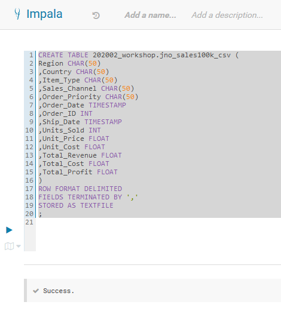
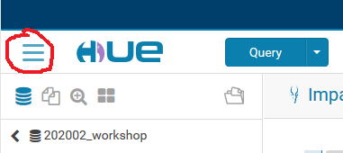
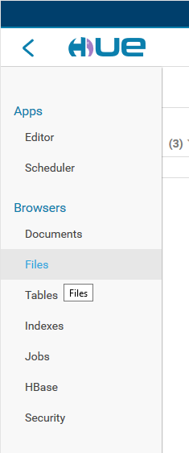
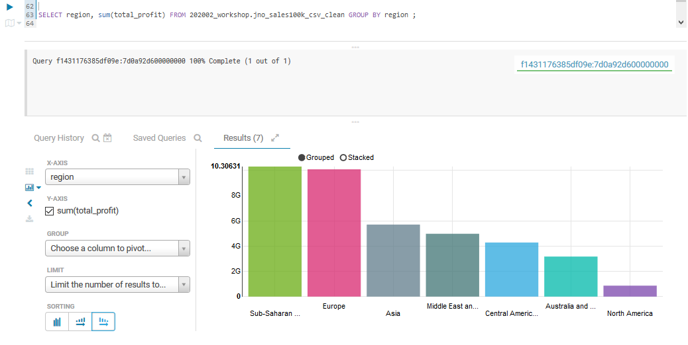

# Lab1: Import data into Hive tables

## Lab goal: 
Once done, user will be able to upload csv dataset into Hadoop table structures and to work with the table via SQL. There will be comparison when creating table stored in csv and parquet. 

### Step 1: Table creation.
The first step is to know data structure and prepare table for dataset. Go to dedicated database where you want to create the table (and have create access in there) and create table. 

Open Impala: Query -> Editor -> Impala

Example bellow: 

> CREATE TABLE 202002_workshop.jno_sales100k_csv (  
> Region CHAR(50)   
> ,Country CHAR(50)  
> ,Item_Type CHAR(50)  
> ,Sales_Channel CHAR(50)  
> ,Order_Priority CHAR(50)  
> ,Order_Date TIMESTAMP   
> ,Order_ID INT  
> ,Ship_Date TIMESTAMP  
> ,Units_Sold INT  
> ,Unit_Price FLOAT  
> ,Unit_Cost FLOAT  
> ,Total_Revenue FLOAT  
> ,Total_Cost FLOAT  
> ,Total_Profit FLOAT  
> )  
> ROW FORMAT DELIMITED  
> FIELDS TERMINATED BY ','  
> STORED AS TEXTFILE  
> ;  

After hitting a RUN button you should be able see Success information under the query. 

### Step 2: Import data
As a next step when table is created it's need to upload data file on HDFS. Go to File Browser. 

Locate to database (usually path: /user/hive/warehouse/databasename.db). Sometimes access though ... isn't possible - usually in situation when user doesn't have access to all folders. Then there is a workaround write exact URL address of database. In this case: https://naczsx012.cz.nonprod:8888/hue/filebrowser/view=/user/hive/warehouse/202002_workshop.db

You should be able to see all existing tables within the database. Table created in the step before should be among them. Table in HDFS is presented as folder - open that folder. In here you should be able see table content. 

Upload your csv file into the table folder. 

Once uploaded run refresh table's metadata: 

> REFRESH databasename.tablename; 

<i> It isn't needed to refresh all tables metadata and sometimes it isn't even possible because of lack of permission to all databases.</i>
  
  <u> It's a good custom to refresh tables metadata after each data manipulation within table/tables when you work with Impala. In case of Hive it isn't needed. Ther reason is that Impala is using Hive metastore and can't update it / refresh metadata.  </u>
  
  
  ### Step 3: Select your data
  At this moment you should be able to see uploaded data in your table. 
  
  > SELECT * FROM 202002_workshop.jno_sales100k_csv; 
  
  <b> At this point you are able to upload any data in csv file into HDFS.  </b>
  
  ### Step 4: Prepare data for analysis 
  
  Chacking data you may noticed two things that will cause some troubles data processing: 
  * Dataset was loaded with header
  * Data in columns contain gaps IN CHAR() data type columns. 
  
  Because Impala doesn't support dropping or deleting a row in a table. The alternative is to either drop the table or migrate the required data to other tables and then delete the entire original table. Together with this we will remove gaps in CHAR() columns by btrim() function. 
  
  
> CREATE TABLE IF NOT EXISTS 202002_workshop.jno_sales100k_csv_clean   
> AS   
> SELECT   
> btrim(region) as region  
> ,btrim(country) as country  
> ,btrim(item_type) as item_type  
> ,btrim(sales_channel) as sales_channel  
> ,btrim(order_priority) as order_priority  
> ,order_date  
> ,order_id  
> ,ship_date  
> ,units_sold  
> ,unit_price  
> ,unit_cost  
> ,total_revenue  
> ,total_cost  
> ,total_profit  
> FROM `202002_workshop`.jno_sales100k_csv  
> WHERE region NOT LIKE ('%Region%') -- from original dataset format   
> AND btrim(region) <> 'Region' -- after removing gaps;  

Data is ready for processing and analysis now. Try some queries and visualizations directly in Impala, e.g.:

  
  ### Step 5: Store your data in compresed table. 
  To use csv file format for storing huge amount of data isn't effective and usually serves as the first step of uploading data. In case you want to keep data in HDFS for a longer time (it isn't one time analysis), it's better to use some file format that supports compression - e.g. Parquet. 
  
  Let's repeate proces - Create table query as a first step: 
  
  > CREATE TABLE 202002_workshop.jno_sales100k_parquet  
> (region STRING   
> ,Country CHAR(50)  
> ,Item_Type CHAR(50)  
> ,Sales_Channel CHAR(50)  
> ,Order_Priority CHAR(50)  
> ,Order_Date TIMESTAMP   
> ,Order_ID INT  
> ,Ship_Date TIMESTAMP  
> ,Units_Sold INT  
> ,Unit_Price FLOAT  
> ,Unit_Cost FLOAT  
> ,Total_Revenue FLOAT  
> ,Total_Cost FLOAT  
> ,Total_Profit FLOAT  
> )  
> stored as PARQUET;   
  
 Once is table succesfully created, migrate data from csv table to parquet ones. 
 
 > INSERT INTO TABLE 202002_workshop.jno_sales100k_parquet SELECT * FROM 202002_workshop.jno_sales100k_csv ;   
 
After this step there is again a need to refresh metadata for this new table: 

> REFRESH 202002_workshop.jno_sales100k_parquet;  

And now you can query the data.

> SELECT * FROM 202002_workshop.jno_sales100k_parquet;   

 
 ### Step 6: Compare table sizes
 
 Navigate to File browser and to the tables where when after opening table folder you will see dataset. As you can just see, CSV file is multiple times bigger.  

  
